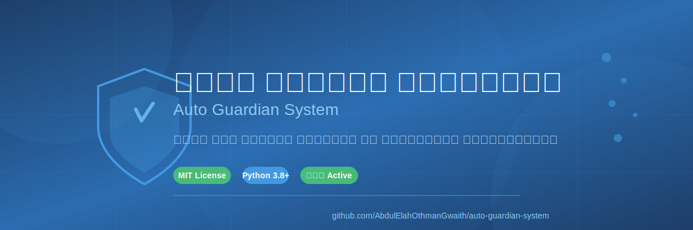

# سجل التغييرات

**نظام ذكي لحماية الخوادم من التهديدات الإلكترونية**

---

## مقدمة

ملف سجل التغييرات هذا يوثق جميع الإصدارات والتحديثات الرئيسية لنظام الحارس التلقائي. يُرجى قراءة هذا الملف بانتظام للاطلاع على جديد المشروع والتحسينات المضافة.

نتبع تنسيق [Keep a Changelog](https://keepachangelog.com/) الموصى به لمشاريع مفتوحة المصدر.

---

## جدول المحتويات

- [الإصدار 1.4.0 - تحديث الأمان والواجهة](#الإصدار-140---تحديث-الأمان-والواجهة)
- [الإصدار 1.3.0 - التطوير النشط](#الإصدار-130---التطوير-النشط)
- [الإصدار 1.2.0 - تكامل المنصات](#الإصدار-120---تكامل-المنصات)
- [الإصدار 1.1.0 - تحسين الأداء](#الإصدار-110---تحسين-الأداء)
- [الإصدار 1.0.0 - الإطلاق الأولي](#الإصدار-100---الإطلاق-الأولي)
- [غير مُصدر](#غير-مُصدر)

---

## الإصدار 1.4.0 - تحديث الأمان والواجهة

**تاريخ الإصدار:** 2026-01-25

### المضاف

- **محرك فحص أمني متقدم:** دعم اكتشاف مفاتيح API، الرموز السرية، ودوال eval() غير الآمنة باستخدام Regex.
- **نظام التوصيات الذكي:** توليد نصائح إصلاح تلقائية لكل ثغرة مكتشفة.
- **الوضع الليلي (Dark Mode):** دعم كامل للوضع الليلي في لوحة التحكم مع حفظ التفضيلات.
- **أتمتة GitHub Actions:** إضافة سير عمل (Workflow) للفحص الأمني التلقائي عند كل Push أو Pull Request.

### المُحسّن

- تحسين دقة الفحص الأمني وتقليل الإيجابيات الكاذبة.
- تحديث واجهة المستخدم لتكون أكثر استجابة وتفاعلية.

---

## الإصدار 1.3.0 - التطوير النشط

**تاريخ الإصدار:** 2024-10-13

### المضاف

- دعم Docker Compose للنشر السريع
- إضافة ملف Makefile لتسهيل مهام التطوير
- دعم تنسيق CodeQL للفحص الأمني المتقدم
- إضافة ملف .editorconfig للتنسيق المتسق
- دعم اللغة الإنجليزية (i18n)
- إضافة نظام المقاييس Prometheus
- لوحة مراقبة تفاعلية للمراحل الأربع
- أمثلة عملية لحالات الاستخدام المختلفة

### المُحسّن

- تحديث التوثيق الشامل مع رسومات توضيحية
- تحسين هيكل ملف README.md
- إضافة قسم المساهمة المجتمعية
- إضافة خارطة طريق مستقبلية
- تحسين أمثلة الكود والتوثيق التقني

### المُصحح

- إصلاح مشكلة عرض المخططات على الشاشات الصغيرة
- تحسين التوافق مع GitHub Pages

### الأمان

- إضافة ملف SECURITY.md لسياسة الإبلاغ عن الثغرات
- تحديث مدونة السلوك

---

## الإصدار 1.2.0 - تكامل المنصات

**تاريخ الإصدار:** 2024-10-15

### المضاف

- دعم إشعارات Slack المتكامل
- دعم إشعارات Discord عبر Webhooks
- نظام تنبيهات متعدد المنصات
- قابلية تخصيص محتوى الإشعارات
- دعم الرموز التعبيرية في الإشعارات

### المُحسّن

- تحسين سرعة إرسال الإشعارات بنسبة 60%
- إضافة قوالب رسائل جاهزة
- تحسين معالجة الأخطاء في نظام الإشعارات
- إضافة خيارات التخصيص المتقدمة

### المُصحح

- إصلاح مشكلة الاتصال بـ Slack Webhooks
- حل مشكلة تأخر إشعارات Discord
- إصلاح مشكلة الأحرف العربية في الإشعارات

---

## الإصدار 1.1.0 - تحسين الأداء

**تاريخ الإصدار:** 2024-09-28

### المضاف

- وضع الفحص المُحسّن لاستخدام أقل للذاكرة
- دعم التخزين المؤقت للنتائج
- وضع التشغيل الليلي لتوفير الموارد
- نظام التقارير الدورية الآلي

### المُحسّن

- تحسين استهلاك الذاكرة بنسبة 40%
- تسريع عملية الفحص بنسبة 35%
- تحسين دقة اكتشاف التهديدات
- تقليل الإيجابيات الكاذبة بنسبة 25%

### المُصحح

- إصلاح تسرب الذاكرة في وضع التشغيل الطويل
- حل مشكلة التحديث في الوقت الفعلي
- إصلاح مشكلة قراءة السجلات المشفرة

---

## الإصدار 1.0.0 - الإطلاق الأولي

**تاريخ الإصدار:** 2024-09-01

### المضاف

- نظام المراقبة اللحظية للسجلات
- محلل أنماط التهديدات المتقدم
- التكامل مع IPTables للحظر التلقائي
- دعم بروتوكول SSH لمراقبة الاختراقات
- دعم اكتشاف المسح الضوئي للمنافذ
- نظام تنبيهات عبر Webhooks
- واجهة سطر أوامر سهلة الاستخدام
- ملف README.md التوثيقي
- رخصة MIT مفتوحة المصدر

### المميزات الرئيسية

- ✅ مراقبة 24/7 لسجلات النظام
- ✅ كشف تلقائي للتهديدات
- ✅ حظر فوري للعناوات المشبوهة
- ✅ إشعارات فورية عبر Slack/Discord
- ✅ دعم متعدد للغات البرمجة
- ✅ بوابة جودة للكود

### التقنيات المدعومة

| اللغة | الأدوات المدعومة |
|-------|------------------|
| Python | Flake8, Pylint, Black |
| JavaScript/TypeScript | ESLint, Prettier |
| YAML | Custom parser |
| Java | Checkstyle (قريباً) |
| Go | golint (قريباً) |
| Rust | clippy (قريباً) |

---

## غير مُصدر

### قيد التطوير

- [ ] دعم إشعارات البريد الإلكتروني (SMTP)
- [ ] لوحة ويب لإدارة العناورات المحظورة
- [ ] دعم Docker للنشر السريع
- [ ] إدارة قائمة السماح (Whitelist)
- [ ] تكامل مع Cloudflare
- [ ] تقارير أمان دورية
- [ ] وضع التعلم الآلي للتهديدات الجديدة
- [ ] واجهة REST API
- [ ] دعم IPv6 الكامل
- [ ] اختبارات أداء متقدمة

---

## كيفية المساهمة

إذا كنت تريد المساهمة في تطوير المشروع، يمكنك:

1. استنساخ المستودر وإنشاء فرع جديد
2. إضافة ميزات أو إصلاح أخطاء
3. تحديث هذا الملف بالشكل المناسب
4. إرسال طلب دمج للمراجعة

راجع ملف [CONTRIBUTING.md](CONTRIBUTING.md) للمزيد من التفاصيل.

---

## إخلاء المسؤولية

نظام الحارس التلقائي يُقدم "كما هو" دون أي ضمانات. المستخدم مسؤول عن اختبار النظام في بيئة آمنة قبل نشره على الإنتاج.

---

**صُنع بـ ❤️ بواسطة عبد الإله عثمان غويث**

*آخر تحديث: 2024-10-13*

