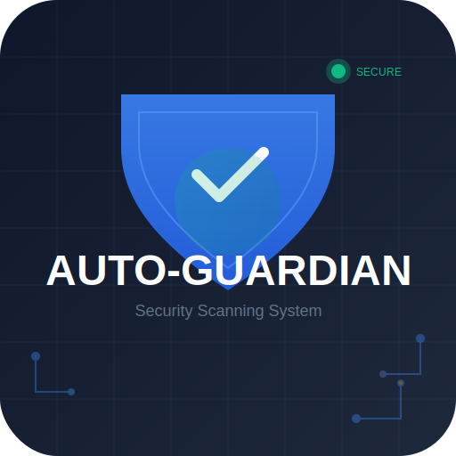
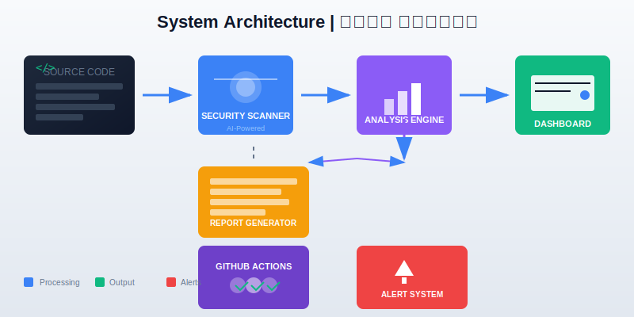
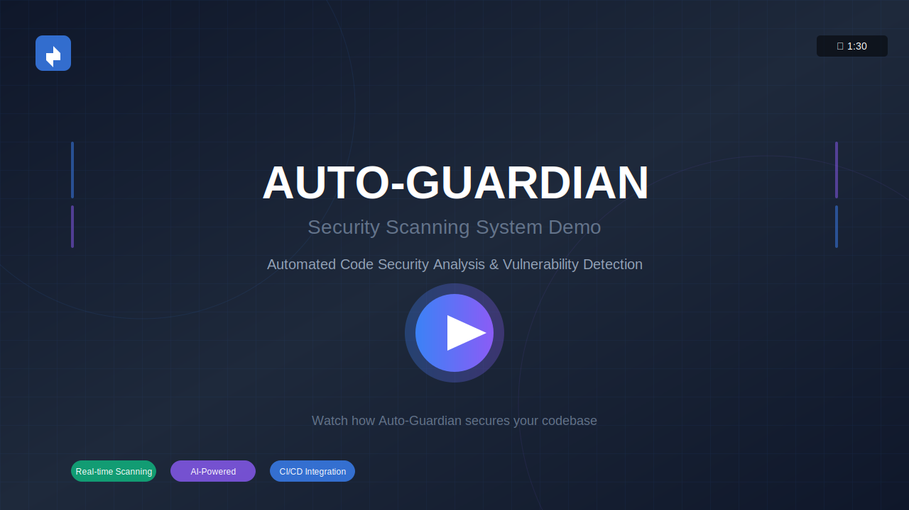

# 🛡️ Auto-Guardian Security System | نظام الحارس التلقائي للأمن

<div align="center">




**نظام متكامل لفحص الكود البرمائي وكشف الثغرات الأمنية بشكل تلقائي**

*Automated Code Security Scanning and Vulnerability Detection System*

</div>

---

## 📋 نظرة عامة | Overview

**نظام Auto-Guardian** هو أداة متكاملة مصممة لتعزيز الأمان في مشاريع البرمجة من خلال فحص الكود آلياً واكتشاف الثغرات الأمنية قبل دمجها في الكود الرئيسي. يجمع النظام بين قوة أدوات التحليل الثابت (Static Analysis) وسهولة الاستخدام من خلال لوحة تحكم ويب متجاوبة تدعم اللغتين العربية والإنجليزية.

يهدف هذا المشروع إلى تمكين فرق التطوير من تبني ممارسات **DevSecOps** بسهولة، حيث يتم دمج الفحص الأمني تلقائياً ضمن دورة حياة التطوير باستخدام **GitHub Actions**. يوفر النظام تقارير تفصيلية عن الثغرات المكتشفة مع تصنيفها حسب مستوى الخطورة، مما يساعد المطورين على تحديد أولويات الإصلاح بكفاءة عالية.

---

## ✨ الميزات الرئيسية | Key Features

### 🔍 الفحص الأمني الآلي | Automated Security Scanning

يستخدم النظام مجموعة متكاملة من أدوات التحليل الأمني للكشف عن الثغرات الشائعة في الكود البرمجي. يدعم النظام فحص مشاريع **Python** و **JavaScript** و **Java** وغيرها من اللغات الشائعة، مع التركيز على الثغرات الأمنية المعروفة مثل حقن SQL وتجاوز المصادقة واستخدام مكتبات غير آمنة.

### 📊 لوحة تحكم تفاعلية | Interactive Dashboard

توفر لوحة التحكم واجهة ويب متجاوبة بالكامل تعرض إحصائيات الأمان بشكل لحظي ومباشر. تدعم اللوحة اللغتين العربية والإنجليزية مع دعم كامل للاتجاه من اليمين لليسار (RTL) للمستخدمين العرب، مما يوفر تجربة مستخدم سلسة ومألوفة لجميع أعضاء الفريق.

### ⚙️ تكامل CI/CD | CI/CD Integration

يأتي النظام مع سير عمل جاهز لـ **GitHub Actions** يمكن تفعيله بنقرة واحدة. يقوم سير العمل بفحص كل طلب دمج (Pull Request) تلقائياً وإضافة تعليقات بالنتائج، مما يمنع دمج الكود الذي يحتوي على ثغرات أمنية خطيرة في الفرع الرئيسي.

### 📈 إنشاء التقارير | Report Generation

يولد النظام تقارير شاملة بتنسيقات متعددة تشمل HTML و JSON و Markdown. تتضمن التقارير إحصائيات تفصيلية عن الثغرات المكتشفة مع توصيات محددة للإصلاح، مما يسهل مشاركة النتائج مع أصحاب المصلحة ومعالجة المشكلات بكفاءة.

### 🔔 نظام الإشعارات | Alerting System

يدعم النظام إرسال إشعارات فورية عند اكتشاف ثغرات حرجة، مما يضمن استجابة سريعة للمشكلات الأمنية العاجلة. يمكن تخصيص الإشعارات لتشمل البريد الإلكتروني والإشعارات داخل GitHub حسب تفضيلات الفريق.

---

## 🖼️ الأيقونات والرسوم | Icons & Graphics

تم تصميم مجموعة متكاملة من الأيقونات والرسوم التوضيحية لتعزيز الهوية البصرية للمشروع:

### أيقونات الميزات | Feature Icons

<div align="center">

 
 
 


</div>

| الأيقونة | الميزة | الوصف |
|---------|--------|-------|
|  | الفحص في الوقت الحقيقي | تحليل فوري للكود مع تحديثات لحظية |
|  | الذكاء الاصطناعي | اكتشاف ذكي للثغرات باستخدام خوارزميات متقدمة |
|  | نظام التنبيهات | إشعارات فورية للمشاكل الأمنية الحرجة |
|  | الفحص الآلي | فحص شامل للكود باستخدام أدوات متعددة |

---

## 🏗️ هيكل النظام | System Architecture

<div align="center">



</div>

يوضح الرسم التوضيحي أعلاه تدفق البيانات في نظام Auto-Guardian من مرحلة إدخال الكود البرمجي وحتى عرض النتائج في لوحة التحكم. يمر الكود بثلاث مراحل رئيسية: الفحص الأمني، تحليل الثغرات، ثم إنشاء التقارير والإشعارات.

---

## 📸 لقطات الشاشة | Screenshots

### لوحة التحكم الرئيسية | Main Dashboard


*واجهة ويب متجاوبة تعرض إحصائيات الأمان والمخططات البيانية*

### عرض الثغرات | Vulnerability Display


*قائمة تفصيلية للثغرات مع تصنيف حسب مستوى الخطورة*

### المخططات البيانية | Charts & Analytics


*مخططات بيانية توضح توزيع الثغرات ونشاط الفحص*

### عرض الجوال | Mobile View


*تصميم متجاوب يعمل بسلاسة على الهواتف المحمولة*

---

## 🎬 الفيديو التوضيحي | Demo Video

<div align="center">

[](VIDEO_SCRIPT.md)

*[شاهد الفيديو التوضيحي الكامل](VIDEO_SCRIPT.md)*

</div>

### محتوى الفيديو | Video Content

| القسم | المدة | الوصف |
|-------|-------|-------|
| المقدمة | 0:00-0:10 | تعريف المشكلة والحل |
| نظرة عامة | 0:10-0:25 | مميزات النظام |
| كيف يعمل | 0:25-0:50 | شرح آليات الفحص |
| لوحة التحكم | 0:50-1:10 | عرض واجهة المستخدم |
| CI/CD التكامل | 1:10-1:25 | دمج GitHub Actions |
| الختام | 1:25-1:30 | دعوة للعمل |

### إنتاج الفيديو | Video Production

للحصول على فيديو احترافي، راجع [دليل إنتاج الفيديو](VIDEO_SCRIPT.md) الذي يحتوي على:
- سيناريو مفصل مع توقيتات دقيقة
- إرشادات التسجيل والمونتاج
- الأصول الجاهزة للاستخدام
- نصائح لل voiceover

---

## 🚀 البدء السريع | Quick Start

### المتطلبات الأساسية | Prerequisites

قبل تثبيت النظام، تأكد من توفر المتطلبات التالية على جهازك:

- **Python**: الإصدار 3.9 أو أحدث
- **Git**: أي إصدار حديث
- **Trivy**: أداة فحص الثغرات (اختياري للتحليل المتقدم)
- **متصفح ويب**: حديث يدعم HTML5 و CSS3

### التثبيت | Installation

اتبع الخطوات التالية لتثبيت النظام على جهازك:

```bash
# 1. استنساخ المستودع | Clone the repository
git clone https://github.com/your-username/auto-guardian-system.git
cd auto-guardian-system

# 2. فك ضغط ملفات المشروع | Extract project files
unzip auto-guardian-docs.zip

# 3. الانتقال إلى مجلد المشروع | Navigate to project directory
cd auto-guardian-docs

# 4. تثبيت المتطلبات | Install dependencies
pip install -r requirements.txt

# 5. تشغيل لوحة التحكم | Launch the dashboard
# الطريقة الأولى: تشغيل محلي باستخدام Python
python -m http.server 8000

# الطريقة الثانية: فتح ملف HTML مباشرة
# افتح dashboard/index.html في متصفح الويب
```

بعد تشغيل الأوامر أعلاه، افتح متصفح الويب وانتقل إلى العنوان `http://localhost:8000` للوصول إلى لوحة التحكم.

### تفعيل GitHub Actions | Enabling GitHub Actions

لتكامل الفحص الأمني مع مستودع GitHub الخاص بك:

```yaml
# 1. انسخ ملف سير العمل إلى مستودعك
# Copy workflow file to your repository
cp auto-guardian-docs/.github/workflows/scan-and-deploy.yml .github/workflows/

# 2. ارفع الملفات إلى GitHub
# Push files to GitHub
git add .
git commit -m "Add Auto-Guardian security scanning"
git push origin main

# 3. فعل GitHub Actions من إعدادات المستودع
# Enable GitHub Actions from repository settings
# اذهب إلى Settings > Actions > General > Allow all actions
```

---

## 📁 هيكل المشروع | Project Structure

```
auto-guardian-system/
├── 📄 README.md                 # ملف التوثيق الرئيسي
├── 📄 LICENSE                   # رخصة MIT
├── 📄 CONTRIBUTING.md           # دليل المساهمة
├── 📄 .gitignore                # استثناءات Git
├── 📄 .eslintrc.json            # إعدادات ESLint
├── 📄 .pylintrc                 # إعدادات Pylint
├── 📄 trivy.yaml                # إعدادات Trivy
│
├── 📂 .github/
│   └── 📂 workflows/
│       └── 📄 scan-and-deploy.yml    # سير عمل GitHub Actions
│
├── 📂 scripts/
│   ├── 📄 aggregate_results.py  # تجميع نتائج الفحص
│   └── 📄 generate_report.py    # إنشاء التقارير
│
├── 📂 dashboard/
│   └── 📄 index.html            # لوحة التحكم (واجهة الويب)
│
└── 📂 docs/                     # التوثيق الإضافي (اختياري)
```

---

## 📊 استخدام لوحة التحكم | Dashboard Usage

### الوصول إلى لوحة التحكم | Accessing the Dashboard

بعد تشغيل لوحة التحكم، سترى الواجهة الرئيسية التي تتضمن:

- **إحصائيات الأمان**: عدد الثغرات المكتشفة ومعدل النجاح وزمن الاستجابة
- **مخططات بيانية**: توضح توزيع الثغرات حسب مستوى الخطورة
- **قائمة المشاكل**: عرض تفصيلي للثغرات مع معلومات الملف والسطر
- **قائمة المستودعات**: حالة المشاريع والفروع النشطة

### البحث والتصفية | Search and Filtering

يوفر صندوق البحث في الجزء العلوي الأيمن إمكانية البحث السريع عن الثغرات والمستودعات. يمكنك أيضاً استخدام الفلاتر الجاهزة لعرض المشاكل الحرجة فقط أو المشاكل المفتوحة.

### الإعدادات | Settings

من خلال قائمة الإعدادات يمكنك تخصيص:

- **لغة الواجهة**: العربية أو الإنجليزية
- **السمة البصرية**: فاتحة أو داكنة
- **الفحص التلقائي**: تشغيل أو إيقاف الفحص عند حفظ الملفات
- **الإشعارات**: تخصيص إشعارات الثغرات الحرجة

---

## 🛠️ تخصيص الفحص | Customizing Scans

### تعديل أدوات الفحص | Modifying Scan Tools

يمكنك تخصيص أدوات الفحص بتعديل ملف `scripts/aggregate_results.py`:

```python
# إضافة أدوات فحص جديدة | Adding new scan tools
SCAN_TOOLS = [
    'bandit',           # فحص Python
    'eslint',           # فحص JavaScript
    'trivy',            # فحص المكتبات
    'semgrep',          # فحص متعدد اللغات
]

# تخصيص قواعد الفحص | Customizing scan rules
SECURITY_RULES = {
    'high': ['sql_injection', 'xss', 'auth_bypass'],
    'medium': ['hardcoded_password', 'weak_crypto'],
    'low': ['deprecated_api', 'unused_import'],
}
```

### إعداد GitHub Actions | Configuring GitHub Actions

لتكيف سير العمل مع احتياجات مشروعك، عدل ملف `.github/workflows/scan-and-deploy.yml`:

```yaml
# تخصيص الفروع للفحص | Customize branches to scan
on:
  push:
    branches: [main, develop]
  pull_request:
    branches: [main]

# تخصيص خطوات الفحص | Customize scan steps
jobs:
  security-scan:
    runs-on: ubuntu-latest
    steps:
      - uses: actions/checkout@v3
      - name: Run Auto-Guardian Scan
        run: |
          python scripts/aggregate_results.py
          python scripts/generate_report.py
```

---

## 🤝 المساهمة في المشروع | Contributing

نرحب بمساهماتكم في تطوير نظام Auto-Guardian! قبل البدء، يرجى قراءة دليل المساهمة:

```bash
# 1. Fork المستودع | Fork the repository

# 2. إنشاء فرع جديد | Create a new branch
git checkout -b feature/new-feature

# 3. إجراء التغييرات | Make your changes

# 4. اختبار التغييرات | Test your changes
python -m pytest tests/

# 5. رفع التغييرات | Push your changes
git push origin feature/new-feature

# 6. إنشاء Pull Request | Create a Pull Request
```

لمزيد من التفاصيل، راجع ملف [CONTRIBUTING.md](CONTRIBUTING.md).

---

## 📝 الترخيص | License

هذا المشروع مرخص تحت **رخصة MIT**، مما يعني أنه يمكنك استخدامه وتعديله وتوزيعه بحرية ضمن شروط الرخصة.

```
MIT License

Copyright (c) 2024 Auto-Guardian Team

Permission is hereby granted, free of charge, to any person obtaining a copy
of this software and associated documentation files (the "Software"), to deal
in the Software without restriction, including without limitation the rights
to use, copy, modify, merge, publish, distribute, sublicense, and/or sell
copies of the Software, and to permit persons to whom the Software is
furnished to do so, subject to the following conditions:
...
```

---

## 📧 التواصل | Contact

للأسئلة والاقتراحات، يمكنك التواصل معنا عبر:

- **GitHub Issues**: للإبلاغ عن الأخطاء وطلب الميزات
- **GitHub Discussions**: للنقاشات والأسئلة العامة
- **البريد الإلكتروني**: للتواصل المباشر

---

<div align="center">

**صُنع بـ ❤️ بواسطة Auto-Guardian Team**

*Built with love and security in mind*

</div>
