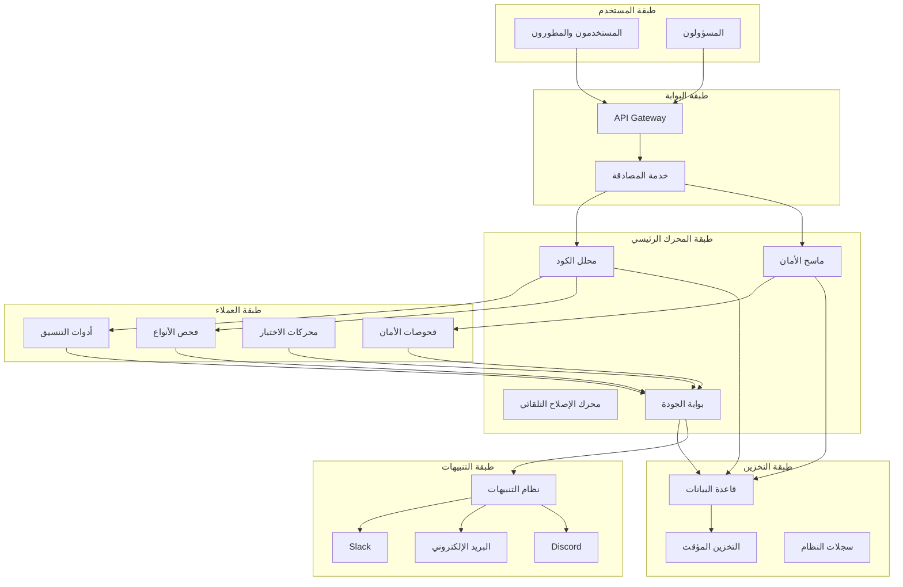

# تقرير تطوير مشروع Auto-Guardian
## هندسة الأمان المؤتمت للأجيال القادمة

---

## الملخص التنفيذي

يمثل مشروع Auto-Guardian نقلة نوعية في مجال أتمتة جودة البرمجيات وأمانها، حيث يجمع بين تقنيات التحليل المتقدمة والذكاء الاصطناعي لتقديم نظام شامل لحماية المستودعات البرمجية. يهدف هذا التقرير إلى توثيق التطورات المقترحة والمخطط لها للمشروع، مع التركيز على تعزيز قدرات النظام الحالية وتوسيع نطاق خدماته ليشمل قاعدة أوسع من المستخدمين والمطورين.

يعالج النظام الحالي فجوة حقيقية في السوق، حيث تعاني معظم الفرق البرمجية من غياب آليات موحدة وفعالة لمراقبة جودة الكود وأمانه بشكل آلي ومستمر. من خلال تقديم مجموعة متكاملة من الأدوات والخدمات، يسعى Auto-Guardian إلى سد هذه الفجوة وتمكين الفرق من التركيز على الابتكار بدلاً من المهام الروتينية المتعلقة بالصيانة والفحص.

تشمل التحديثات المقترحة في هذا التقرير إضافة ميزات متقدمة تعتمد على الذكاء الاصطناعي، وتطوير واجهات مستخدم أكثر حداثة وسهولة في الاستخدام، وتوسيع دعم اللغات والمنصات، وتعزيز قدرات التكامل مع أدوات التطوير الشائعة. كما يتضمن التقرير خططاً لتوفير لوحة تحكم مركزية وإمكانية التشغيل على مستوى المؤسسات.

---

## المقدمة

### السياق والخلفية

في عالم تطوير البرمجيات الحديث، أصبحت جودة الكود وأمانه من أهم العوامل التي تحدد نجاح المشاريع والorganizations. مع تزايد تعقيد المشاريع البرمجية وتنوع التقنيات المستخدمة، يجد المطورون أنفسهم أمام تحدٍّ كبير في الحفاظ على معايير الجودة والأمان بشكل يدوي. هذا التحدي يستهلك وقتاً وجهداً كبيرين، ويفتح الباب أمام أخطاء قد تكون مكلفة.

تشير الدراسات إلى أن تكلفة إصلاح الأخطاء البرمجية تزداد بشكل كبير كلما تأخر اكتشافها في دورة التطوير. في المراحل المبكرة من التطوير، قد لا تتجاوز تكلفة الإصلاح بضع ساعات من العمل، بينما في مرحلة الإنتاج قد تصل إلى أيام أو أسابيع، ناهيك عن الأضرار المحتملة للسمعة والثقة. هذا الواقع يجعل الاستثمار في أدوات الفحص الآلي ضرورة ملحة وليس ترفاً.

### الحاجة إلى الأتمتة

توفر أتمتة عمليات فحص الجودة والأمان العديد من المزايا التي لا يمكن تحقيقها يدوياً. أولاً، تضمن الأتمتة الاتساق في تطبيق المعايير عبر جميع التغييرات، بغض النظر عن حجم الفريق أو عدد المشاريع. ثانياً، توفر سرعة التنفيذ التي تسمح بفحص الكود في وقت قياسي مقارنة بالفحص اليدوي. ثالثاً، تقلل من العبء على المطورين，使他们 يستطيعون التركيز على المهام الإبداعية والتصميمية. وأخيراً، توفر توثيقاً دقيقاً لجميع المشكلات المكتشفة والإجراءات المتخذة.

يهدف مشروع Auto-Guardian إلى تقديم هذه الفوائد بشكل متكامل وميسر، مع التركيز على سهولة الاستخدام والتكامل مع سير العمل اليومي للفرق البرمجية. يتبنى المشروع فلسفة توفير الرؤية والأتمتة دون تعقيد، مما يجعله مناسباً للفرق بمختلف أحجامها ومستويات خبرتها.

---

## الهندسة التقنية

### نظرة عامة على البنية

تعتمد بنية Auto-Guardian على تصميم متعدد الطبقات يوفر المرونة والقابلية للتوسع. تتكون البنية من خمس طبقات رئيسية تعمل بشكل متكامل لتقديم خدمات شاملة للفحص والحماية. يتيح هذا التصميم فصل المسؤوليات بين المكونات المختلفة، مما يسهل عملية الصيانة والتطوير المستقبلي.

تتضمن الطبقة الأولى واجهة المستخدم التي تشمل لوحة التحكم الويب وواجهة سطر الأوامر، بالإضافة إلى التكامل مع بيئات التطوير المتكاملة. توفر هذه الطبقة نقاط وصول متعددة تناسب مختلف احتياجات المستخدمين، من المطورين الأفراد إلى فرق المؤسسات الكبيرة. تدعم الواجهات الحديثة تقنيات الاستجابة الكاملة، مما يضمن تجربة مستخدم متسقة عبر جميع الأجهزة.

تأتي بعد ذلك طبقة البوابة التي تتولى إدارة الطلبات والمصادقة. تعمل هذه الطبقة كنقطة دخول موحدة لجميع الطلبات، وتضمن تطبيق سياسات الأمان والوصول بشكل مركزي. تستخدم البوابة تقنيات التخزين المؤقت لتحسين الأداء وتقليل الحمل على الطبقات الخلفية.

### محركات التحليل

يشكل محرك التحليل قلب النظام، حيث يتولى مسؤولية فحص الكود واكتشاف المشكلات. يعتمد المحرك على مجموعة متنوعة من الأدوات المتخصصة التي تغطي جوانب مختلفة من الجودة والأمان. تشمل هذه الأدوات أدوات التنسيق اللغوي مثل ESLint وFlake8 وPylint، وماسحات الأمان مثل Bandit وSecurityScanner، ومحركات فحص الأنواع، وأدوات تحليل الأداء.

يتضمن المحرك منطقاً ذكياً لدمج نتائج الفحص من مختلف الأدوات وتصفيتها وتوجيهها. يستخدم هذا المنطق قواعد قابلة للتخصيص لتحديد أولويات المشكلات وتجنب التكرار. كما يوفر إمكانية إضافة قواعد مخصصة تلبي احتياجات محددة للمشاريع والفرق.

### نظام الإصلاح التلقائي

يمثل نظام الإصلاح التلقائي أحد أهم مميزات Auto-Guardian، حيث يتجاوز مجرد اكتشاف المشكلات إلى إصلاحها تلقائياً عندما يكون ذلك آمناً وممكناً. يشمل الإصلاح التلقائي مشاكل التنسيق وأنماط الكود السيئة وإصلاحات الأمان البسيطة. يتبع النظام نهجاً متحفظاً في الإصلاح التلقائي، حيث لا يقوم بإصلاح إلا المشكلات التي لديه ثقة عالية في صحة الإصلاح.

يتم توثيق جميع الإصلاحات التلقائية في سجل مفصل يتيح للمطورين مراجعة التغييرات ومراجعتها. يمكن تكوين النظام لإرسال طلبات مراجعة للإصلاحات التي تتطلب موافقة بشرية، مما يوفر التوازن بين الأتمتة والرقابة.

### طبقة التخزين والإشعارات

توفر طبقة التخزين استمرارية البيانات وإمكانية تتبع التاريخ. تستخدم قاعدة بيانات علائقية لتخزين نتائج الفحص والإعدادات، مع دعم للنسخ الاحتياطي والاستعادة. تتضمن الطبقة أيضاً نظام تخزين مؤقت لتحسين أداء الاستعلامات المتكررة.

يتولى نظام الإشعارات مهمة التواصل مع المستخدمين حول حالة الفحص والمشاكل المكتشفة. يدعم النظام قنوات إشعار متعددة تشمل البريد الإلكتروني والرسائل الفورية عبر Slack وDiscord، بالإضافة إلى إشعارات داخل منصة GitHub نفسها. يمكن للمستخدمين تخصيص تفضيلات الإشعارات لكل مشروع على حدة.

### المخطط البياني للبنية

---

## الميزات الأساسية

### المراقبة الحية

توفر ميزة المراقبة الحية رؤية فورية لحالة جميع المشاريع والمراقبة المستمرة للتغييرات. تعرض لوحة التحكم الرئيسية ملخصاً شاملاً يتضمن عدد التهديدات المحظورة ومعدل نجاح الفحوصات وزمن الاستجابة والمشكلات المفتوحة. يتم تحديث هذه المعلومات في الوقت الفعلي، مما يمكّن الفرق من الاستجابة السريعة لأي مشكلات.

تشمل المراقبة الحية أيضاً رسوماً بيانية توضح اتجاهات الجودة والأمان عبر الزمن. تتيح هذه الرسوم تحديد الأنماط والمشكلات المتكررة التي قد تشير إلى حاجة لتدريب إضافي أو تغييرات في العمليات. كما توفر تنبيهات فورية للمشكلات الحرجة التي تتطلب اهتماماً فورياً.

### الحماية الآلية

تتجاوز الحماية الآلية مجرد الاكتشاف إلى منع المشكلات قبل وصولها إلى الكود الأساسي. من خلال بوابة الجودة، يتولى النظام فحص جميع طلبات السحب والتحقق من استيفائها للمعايير المحددة. يتم حظر طلبات السحب التي تفشل في الفحص من الدمج، مما يضمن أن الكود الجديد يلتزم بمعايير الجودة.

تتضمن الحماية الآلية أيضاً ميزات استباقية مثل تحليل التبعيات ومراقبة الثغرات الأمنية المعروفة. عند اكتشاف ثغرة في إحدى المكتبات المستخدمة، يُعلم النظام الفريق فوراً ويقترح تحديثات آمنة. كما يوفر تقارير دورية عن حالة الأمان والتوصيات للتحسين.

### تحليل البيانات

يوفر النظام قدرات متقدمة في تحليل البيانات لاستخراج رؤى قيمة من نتائج الفحص. تشمل هذه القدرات تتبع مؤشرات الأداء الرئيسية مثل عدد المشكلات المكتشفة ومعدل الإصلاح ومتوسط وقت الاستجابة. تتيح واجهة التحليل تصفية البيانات حسب المشروع واللغة ونوع المشكلة ومستوى الخطورة.

تشمل القدرات التحليلية أيضاً رسم خرائط للتبعيات بين المشاريع وتحديد المخاطر المحتملة للتغييرات. من خلال تحليل تأثير التغييرات، يمكن للنظام تحديد المشاريع والمكونات الأكثر تأثراً بأي تغيير، مما يساعد في تقييم المخاطر وتخطيط الاختبارات.

### التقارير الذكية

يولد النظام تقارير متنوعة تناسب احتياجات مختلفة. تشمل التقارير المتاحة التقارير التنفيذية للإدارة التي تلخص الحالة العامة وتوجهات الجودة، والتقارير التفصيلية للفنيين التي تتضمن معلومات دقيقة عن كل مشكلة والإجراءات المقترحة لحلها. كما تتوفر تقارير مطابقة للمعايير التنظيمية مثل OWASP وISO 27001.

يمكن تخصيص التقارير وتصديرها بصيغ متعددة تشمل PDF وExcel وHTML. يدعم النظام أيضاً التصدير الآلي للتقارير عبر البريد الإلكتروني أو تخزينها في منصات مشاركة الملفات. كما يتضمن إمكانية جدولة التقارير الدورية لتوليدها وإرسالها تلقائياً.

---

## التحديات والحلول

### التعامل مع البيانات الضخمة

يواجه النظام تحدياً في معالجة كميات كبيرة من البيانات الناتجة عن فحص المشاريع الكبيرة والمتكررة. يتضمن ذلك ملايين الأسطر من الكود ونتائج آلاف الفحوصات. للتعامل مع هذا التحدي، يعتمد النظام على استراتيجية تخزين مؤقت ذكية تحتفظ بالنتائج الأخيرة وتتجاهل البيانات الأقل استخداماً.

كما يستخدم النظام تقنيات المعالجة المتوازية لتوزيع الأحمال عبر خوادم متعددة. يتضمن ذلك تقسيم المشاريع الكبيرة إلى أجزاء أصغر يمكن معالجتها بشكل متوازٍ، ثم تجميع النتائج في النهاية. هذا النهج يقلل زمن الفالجة بشكل كبير ويحسن استجابة النظام.

### التوازن بين الدقة والإنتاجية

يمثل تحقيق التوازن بين شمولية الفحص وسرعة التنفيذ تحدياً مستمراً. الفحص الأكثر شمولية يستغرق وقتاً أطول، مما قد يؤثر على تجربة المطورين وسرعة دورات التطوير. للتعامل مع هذا، يستخدم النظام نهجاً تكيفياً يحدد مستوى الفحص بناءً على حجم التغييرات وسياقها.

في حالة التغييرات الصغيرة، يمكن إجراء فحص خفيف يركز على المناطق المتأثرة فقط. أما التغييرات الكبيرة فتتطلب فحصاً شاملاً. كما يوفر النظام خيارات للمستخدمين لتحديد أولويات الفحص وتخصيص الموارد وفقاً لاحتياجاتهم.

### التقليل من الإيجابيات الكاذبة

تعد الإيجابيات الكاذبة، أي الإبلاغ عن مشكلات غير حقيقية، من أكبر تحديات أنظمة الفحص الآلي. العدد الكبير من التنبيهات الخاطئة يؤدي إلى إرهاق المطورين وتقليل ثقتهم في النظام. للتعامل مع هذا التحدي، يعتمد النظام على آليات تعلم مستمرة تحسن دقة الاكتشاف بناءً على ملاحظات المستخدمين.

يتضمن النظام أيضاً قواعد ذكية لتصفية التنبيهات بناءً على السياق وتاريخ المشروع. عند اكتشاف أنماط متكررة من التنبيهات التي يتجاهلها المطورون، يتعلم النظام منها ويعدل قواعده وفقاً لذلك. كما يوفر واجهة سهلة للمستخدمين للإبلاغ عن التنبيهات الخاطئة مباشرة.

---

## خارطة الطريق

### المرحلة الأولى: تعزيز الأساس (الربع القادم)

تركز هذه المرحلة على تحسين قدرات النظام الحالية وتعزيز استقراره. يشمل ذلك تحسين أداء محركات الفحص بنسبة لا تقل عن ثلاثين بالمئة، وإضافة دعم للغات جديدة تشمل Rust وKotlin. كما تتضمن تحسين واجهة المستخدم وإضافة ميزات طلبها المجتمع.

من الأهداف الرئيسية في هذه المرحلة تطوير نظام الإصلاح التلقائي ليشمل أنواعاً إضافية من المشكلات. يتضمن ذلك إصلاح مشاكل الأمان البسيطة وإعادة هيكلة أنماط الكود السيئة. كما سيتم تحسين التكامل مع منصات CI/CD الشائعة لتسهيل عملية التبني.

### المرحلة الثانية: الذكاء الاصطناعي (الربع الثاني)

تمثل هذه المرحلة نقلة نوعية في قدرات النظام من خلال دمج تقنيات الذكاء الاصطناعي. سيتضمن ذلك نموذجاً متقدماً لتحليل الكود يمكنه فهم السياق وتقديم اقتراحات ذكية. كما سيتم تطوير نظام تنبؤي يحدد المشاكل المحتملة قبل حدوثها.

تشمل التطبيقات الأخرى للذكاء الاصطناعي تحسين تصنيف المشكلات وتحديد الأنماط في أخطاء الفريق. كما سيتم تطوير مساعد ذكي يقترح حلولاً للمشاكل بناءً على المعرفة المتراكمة من مشاريع مماثلة. هذا سيقلل بشكل كبير وقت حل المشاكل ويحسن جودة الحلول.

### المرحلة الثالثة: منصة المؤسسات (الربع الثالث)

تركز هذه المرحلة على تلبية احتياجات المؤسسات الكبيرة من خلال تطوير منصة متعددة المستأجرين. سيتضمن ذلك لوحات تحكم مركزية تتيح للمسؤولين إدارة جميع مشاريع المؤسسة من مكان واحد، مع صلاحيات متدرجة وإمكانية تخصيص واسعة.

كما تتضمن هذه المرحلة تطوير واجهات برمجة تطبيقات متقدمة للتكامل مع أنظمة المؤسسات القائمة. يشمل ذلك التكامل مع أنظمة إدارة الهوية والوصول وأنظمة المراقبة والتتبع. كما سيتم توفير خيارات نشر مرنة تشمل النشر السحابي والخاص.

### المرحلة الرابعة: النظام البيئي (الربع الرابع)

تهدف هذه المرحلة إلى بناء نظام بيئي متكامل حول Auto-Guardian. يتضمن ذلك إطلاق منصة للمكونات الإضافية تتيح للمجتمع تطوير إضافات توسع قدرات النظام. كما سيتم إنشاء marketplace للتكاملات والمكونات الإضافية.

تشمل الأهداف الأخرى في هذه المرحلة تطوير برنامج شراكات مع مزودي خدمات الحوسبة السحابية وأدوات التطوير. كما سيتم إطلاق برنامج شهادات للمطورين المتخصصين في استخدام النظام، مما يعزز القيمة المهنية للمستخدمين.

---

## واجهة المستخدم المصممة

### لوحة التحكم الرئيسية

تم تصميم لوحة تحكم حديثة وسهلة الاستخدام توفر رؤية شاملة لحالة النظام. تتضمن اللوحة أقساماً واضحة لعرض الإحصائيات الرئيسية والرسوم البيانية النشاط الأخير والمستودعات النشطة. يعتمد التصميم على مبدأ البطاقات التي تسهل قراءة المعلومات وتجعلها قابلة للفحص السريع.

تتميز اللوحة بنظام ألوان متناسق يعكس هوية النظام البصرية. تستخدم الألوان الكحلية والزرقاء لإعطاء انطباع بالأمان والموثوقية، مع استخدام الأخضر للإشارة إلى النجاح والأحمر للتنبيهات. التصميم متجاوب ويعمل بشكل ممتاز على مختلف أحجام الشاشات.

### الرسوم البيانية التوضيحية

تم إنشاء مجموعة من الرسوم البيانية التوضيحية التي تجسد مفاهيم النظام الرئيسية. تتضمن هذه الرسوم أيقونة المراقبة الحية التي تظهر رقصة مسح رادارية توضح عملية الفحص المستمرة، وأيقونة الحماية الآلية التي تجمع بين رمز الدرع والتروس لترمز إلى الحماية الذكية، وأيقونة تحليل البيانات التي توضح تدفق البيانات والتحليل المتصاعد.

جميع الرسوم البيانية مصممة بأسلوب مسطح عصري يتناسب مع الهوية البصرية للنظام. تستخدم ألوان متناسقة وعناصر هندسية ناعمة تجعل المعلومات سهلة الفهم والجذابة بصرياً. يمكن استخدام هذه الرسوم في الوثائق والعروض التقديمية والمواد التسويقية.

### الفيديو التوضيحي

تم إعداد سيناريو مفصل لفيديو توضيحي يمتد من ستين إلى تسعين ثانية. يتبع الفيديو هيكلاً واضحاً يبدأ بإثارة المشكلة ويعرض الحل ثم يستعرض الميزات وينتهي بدعوة للعمل. يتضمن السيناريو تفاصيل دقيقة للمشاهد والرسوم المتحركة والتعليق الصوتي.

تم تصميم الفيديو ليكون جذاباً ومهماً، مع التركيز على تقديم رسالة واضحة ومؤثرة. يتضمن السيناريو ترجمة إنجليزية كاملة لجعل المحتوى متاحاً لجمهور أوسع. كما يتضمن مواصفات تقنية للإنتاج تشمل الألوان والخطوط والمؤثرات الصوتية.

---

## المعايير والسياسات

### معايير جودة الكود

يلتزم النظام بمجموعة شاملة من معايير جودة الكود التي تغطي جوانب متعددة من البرمجيات. تشمل هذه المعايير معايير التنسيق التي تحدد أسلوب الكتابة المتسق، ومعايير الوثائق التي تضمن توفر تعليقات كافية، ومعايير الأمان التي تمنع الأنماط غير الآمنة، ومعايير الأداء التي تضمن الكفاءة.

يمكن تخصيص هذه المعايير لكل مشروع على حدة، مع توفير قوالب جاهزة لأنواع المشاريع الشائعة. يتضمن النظام أيضاً أدوات لفرض المعايير تلقائياً ومنع الكود الذي لا يلتزم بها من الوصول إلى الكود الأساسي.

### سياسات الأمان

تتبنى النظام سياسات أمان صارمة لحماية البيانات والأنظمة. تتضمن هذه السياسات تشفير البيانات في حالة السكون والنقل، واستخدام المصادقة متعددة العوامل، وتطبيق مبدأ الحد الأدنى من الصلاحيات. كما تتضمن سياسات للتعامل مع الثغرات الأمنية المكتشفة.

يلتزم النظام بمتطلبات اللوائح العالمية لحماية البيانات مثل GDPR، مع توفير أدوات للامتثال ومراجعة الوصول. كما يتضمن سجلات تدقيق شاملة لجميع العمليات الحساسة، مما يتيح المراجعة والتتبع عند الحاجة.

---

## الخاتمة

يمثل مشروع Auto-Guardian خطوة مهمة نحو أتمتة جودة البرمجيات وأمانها بشكل شامل ومتكامل. من خلال الجمع بين أدوات الفحص المتقدمة والذكاء الاصطناعي، يوفر النظام قدرة غير مسبوقة على اكتشاف المشكلات وإصلاحها تلقائياً. كما يضمن تصميمه المتعدد الطبقات المرونة والقابلية للتوسع لتلبية احتياجات الفرق بمختلف أحجامها.

توفر خارطة الطريق الموضحة في هذا التقرير رؤية واضحة لمسار تطوير المشروع في المستقبل القريب. من خلال المراحل الأربع المحددة، سيتحول النظام تدريجياً من أداة فحص بسيطة إلى منصة متكاملة لإدارة جودة البرمجيات على مستوى المؤسسات. سيتيح ذلك للفرق تبني النظام تدريجياً والتمتع بمزاياه المتزايدة مع نمو احتياجاتهم.

ندعو المطورين والمساهمين للانضمام إلى مشروع Auto-Guardian والمساهمة في تطويره. سواء من خلال الإبلاغ عن المشاكل أو اقتراح ميزات جديدة أو كتابة وثائق أو تطوير إضافات، كل مساهمة تساعد في جعل النظام أفضل للجميع. معاً، يمكننا بناء مستقبل يكون فيه كل كود آمناً وعالي الجودة.

---

## المراجع والروابط

- **المستودع الرئيسي:** github.com/AbdulElahOthmanGwaith/auto-guardian-system
- **الموقع الرسمي:** autoguardian.dev
- **التوثيق:** docs.autoguardian.dev
- **الدعم:** support@autoguardian.dev

---

*نهاية التقرير*
